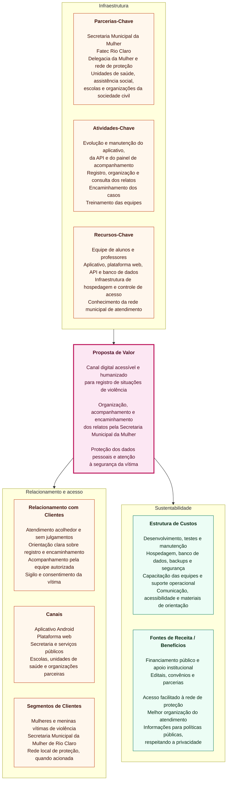

## Business Model Canvas – Fatec Women

```mermaid
flowchart TB
	subgraph esquerda[Infraestrutura]
		direction LR
		parceiros["<b>Parcerias-Chave</b><br/><br/>Secretaria Municipal da Mulher<br/>Fatec Rio Claro<br/>Delegacia da Mulher e rede de proteção<br/>Unidades de saúde, assistência social,<br/>escolas e organizações da sociedade civil"]
		atividades["<b>Atividades-Chave</b><br/><br/>Evolução e manutenção do aplicativo,<br/>da API e do painel de acompanhamento<br/>Registro, organização e consulta dos relatos<br/>Encaminhamento dos casos<br/>Treinamento das equipes"]
		recursos["<b>Recursos-Chave</b><br/><br/>Equipe de alunos e professores<br/>Aplicativo, plataforma web, API e banco de dados<br/>Infraestrutura de hospedagem e controle de acesso<br/>Conhecimento da rede municipal de atendimento"]
	end

	proposta["<b>Proposta de Valor</b><br/><br/>Canal digital acessível e humanizado<br/>para registro de situações de violência<br/><br/>Organização, acompanhamento e encaminhamento<br/>dos relatos pela Secretaria Municipal da Mulher<br/><br/>Proteção dos dados pessoais e atenção<br/>à segurança da vítima"]

	subgraph relacionamento[Relacionamento e acesso]
		direction LR
		relacionamento_cliente["<b>Relacionamento com Clientes</b><br/><br/>Atendimento acolhedor e sem julgamentos<br/>Orientação clara sobre registro e encaminhamento<br/>Acompanhamento pela equipe autorizada<br/>Sigilo e consentimento da vítima"]
		canais["<b>Canais</b><br/><br/>Aplicativo Android<br/>Plataforma web<br/>Secretaria e serviços públicos<br/>Escolas, unidades de saúde e organizações parceiras"]
		segmentos["<b>Segmentos de Clientes</b><br/><br/>Mulheres e meninas vítimas de violência<br/>Secretaria Municipal da Mulher de Rio Claro<br/>Rede local de proteção, quando acionada"]
	end

	subgraph sustentabilidade[Sustentabilidade]
		direction LR
		custos["<b>Estrutura de Custos</b><br/><br/>Desenvolvimento, testes e manutenção<br/>Hospedagem, banco de dados, backups e segurança<br/>Capacitação das equipes e suporte operacional<br/>Comunicação, acessibilidade e materiais de orientação"]
		beneficios["<b>Fontes de Receita / Benefícios</b><br/><br/>Financiamento público e apoio institucional<br/>Editais, convênios e parcerias<br/><br/>Acesso facilitado à rede de proteção<br/>Melhor organização do atendimento<br/>Informações para políticas públicas,<br/>respeitando a privacidade"]
	end

	esquerda --> proposta
	proposta --> relacionamento
	proposta --> sustentabilidade

	classDef bloco fill:#fff7ed,stroke:#c2410c,color:#431407,stroke-width:1px
	classDef valor fill:#fce7f3,stroke:#be185d,color:#500724,stroke-width:3px
	classDef base fill:#ecfdf5,stroke:#047857,color:#052e16,stroke-width:1px
	class parceiros,atividades,recursos,relacionamento_cliente,canais,segmentos bloco
	class proposta valor
	class custos,beneficios base
```
