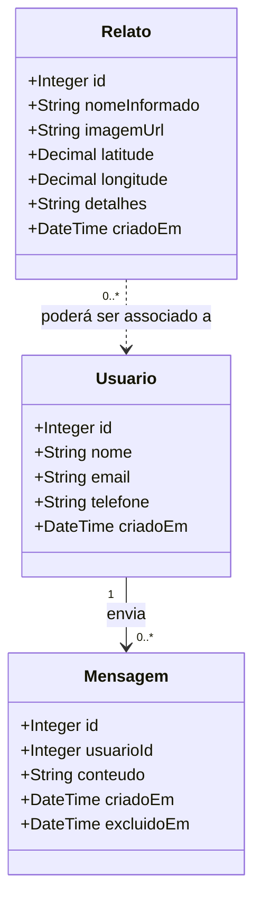

# Modelo de Domínio - Fatec Women

## 1. Objetivo

O Fatec Women é um aplicativo de apoio ao registro e à consulta de relatos de violência contra mulheres. O sistema recebe informações fornecidas pela pessoa usuária, armazena o relato e permite sua consulta pela interface de acompanhamento.

Este documento descreve o domínio conforme o estado atual do protótipo. Funcionalidades citadas no README, mas que ainda não possuem implementação correspondente, são identificadas como evolução prevista.

## 2. Atores

| Ator | Responsabilidade no domínio |
| --- | --- |
| Mulher vítima ou pessoa denunciante | Informa os dados do caso e envia um relato. O nome e a localização são opcionais no protótipo. |
| Secretaria da Mulher / equipe autorizada | Consulta relatos para acompanhamento e encaminhamento dos casos. |
| Sistema | Valida os dados obrigatórios, registra data e hora e disponibiliza os relatos cadastrados. |

## 3. Diagrama de domínio

> A associação entre `Relato` e `Usuario` é uma possibilidade de evolução, não uma relação existente no esquema atual. A tabela `reports` não possui `user_id`; portanto, o relato permanece sem vínculo persistido com uma conta.

## 4. Entidades e atributos

### 4.1 Usuário

Representa uma pessoa cadastrada para uso autenticado ou para comunicação com o serviço.

| Atributo | Obrigatório | Regra atual |
| --- | --- | --- |
| `id` | Sim | Identificador único gerado pelo banco. |
| `name` | Sim | Até 100 caracteres. |
| `email` | Sim | Único, até 100 caracteres. |
| `phone` | Sim | Único, até 100 caracteres. |
| `created_at` | Não | Preenchido automaticamente com a data de criação. |

No protótipo atual não existem endpoints de cadastro, login ou autenticação implementados para essa entidade.

### 4.2 Relato

Representa uma ocorrência informada ao sistema. É a entidade central do domínio implementado.

| Atributo | Obrigatório | Regra atual |
| --- | --- | --- |
| `id` | Sim | Identificador único gerado pelo banco. |
| `name` | Não | Nome informado no relato; pode ser omitido para preservar o anonimato. |
| `image_url` | Não | Referência opcional a uma imagem. |
| `latitude` | Não | Coordenada geográfica da ocorrência. |
| `longitude` | Não | Coordenada geográfica da ocorrência. |
| `details` | Sim | Descrição textual do caso; não pode ser vazia. |
| `created_at` | Não | Preenchido automaticamente e usado para ordenar os relatos do mais recente ao mais antigo. |

O relato não possui status, classificação, dados do agressor, encaminhamento ou vínculo com usuário no modelo atual.

### 4.3 Mensagem

Representa uma mensagem associada a um usuário. A estrutura existe no esquema inicial e prevê exclusão lógica, mas ainda não é utilizada pelos endpoints atuais.

| Atributo | Obrigatório | Regra atual |
| --- | --- | --- |
| `id` | Sim | Identificador único gerado pelo banco. |
| `user_id` | Sim | Referência a `users(id)`. |
| `content` | Sim | Conteúdo textual da mensagem. |
| `created_at` | Não | Preenchido automaticamente. |
| `deleted_at` | Não | Quando preenchido, indica exclusão lógica. |

## 5. Relacionamentos

- Um `Usuário` pode enviar várias `Mensagens`.
- Cada `Mensagem` pertence a um único `Usuário` por meio de `user_id`.
- A exclusão de um `Usuário` remove suas `Mensagens` (`ON DELETE CASCADE`).
- Um `Relato` não está associado a um `Usuário` no banco atual. O campo `name` é apenas um dado informado no relato.

## 6. Regras de negócio atuais

1. Um relato só pode ser criado quando `details` é informado.
2. Nome, imagem e localização são opcionais.
3. Relatos são persistidos com data e hora de criação automática.
4. A consulta de relatos retorna os registros em ordem decrescente de criação.
5. Usuários possuem email e telefone únicos no esquema do banco.
6. Mensagens devem pertencer a um usuário existente.
7. A exclusão de mensagens é prevista como exclusão lógica por meio de `deleted_at`.

## 7. Casos de uso

| Caso de uso | Ator | Situação |
| --- | --- | --- |
| Enviar relato | Mulher vítima ou pessoa denunciante | Implementado via `POST /reports`. |
| Consultar relatos | Secretaria / equipe autorizada | Implementado via `GET /reports`; autorização ainda não está implementada. |
| Verificar disponibilidade do serviço | Sistema / equipe técnica | Implementado via `GET /health`. |
| Criar conta | Pessoa usuária | Previsto; sem endpoint atual. |
| Autenticar usuário | Pessoa usuária | Previsto; o login da interface é simulado localmente. |
| Enviar mensagem | Usuário | Previsto no esquema; sem endpoint atual. |
| Encaminhar e acompanhar caso | Secretaria / equipe autorizada | Previsto; faltam status, histórico e responsável pelo atendimento. |

## 8. Limites e próximos incrementos do domínio

Para uma próxima versão, recomenda-se avaliar:

- associar um relato a um usuário somente quando isso não comprometer o anonimato da pessoa denunciante;
- adicionar `status` e histórico de encaminhamento do relato;
- modelar o agressor e os serviços ou autoridades para os quais o caso foi encaminhado;
- definir autenticação e autorização para impedir que relatos sejam consultados publicamente;
- validar latitude e longitude como um par e proteger dados sensíveis;
- definir retenção, auditoria e controle de acesso para relatos e mensagens.
